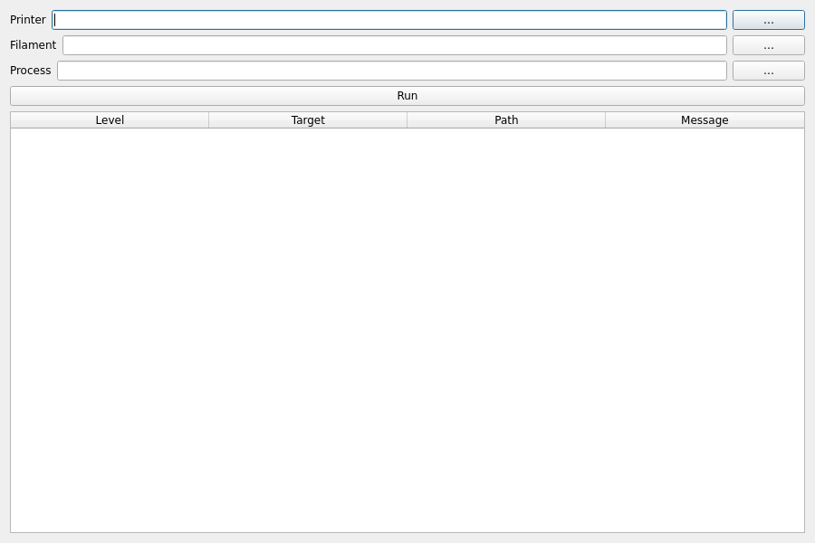

# OpenPrintKit Benutzerhandbuch (Entwurf)

Dieser Text ist eine erste deutschsprachige Fassung. Die vollständige Referenz befindet sich in `docs/user-manual.md` (Englisch).

## Einführung

OpenPrintKit (OPK) definiert ein PDL und erzeugt daraus Profile für mehrere Slicer (Orca, Cura, Prusa/SuperSlicer, Bambu) inkl. Validierung und Regeln.

## Installation

Nutzung (PyPI):
```bash
pip install openprintkit
# mit GUI
pip install 'openprintkit[gui]'
```

Entwicklung (editable):
```bash
python -m venv .venv
source .venv/bin/activate
pip install -e .
```

## Häufige Aufgaben

- Validieren: `opk validate ...`
- Regeln: `opk rules --printer P --filament F --process S`
- Generieren: `opk gen --pdl datei.yaml --slicer orca --out outdir`
- Paket: `opk bundle --in src --out profil.orca_printer`
- Installation (Orca): `opk install --src src --dest pfad/presets`

## GUI

Start: `opk-gui`

Reiter: Bauraum, Extruder, Multimaterial, Filamente, Funktionen, Maschinensteuerung, Peripherie, G‑code.

Tipps:
- Dialoge merken letzte Pfade (QSettings).
- Tools → G‑code‑Vorschau / Variablen validieren.
- Profile generieren (Vorschau vor Schreiben) und Start/End‑Snippets.

---

Beiträge zur Übersetzung sind willkommen.

## Schnellstart (CLI)

Beispiele validieren:
```bash
opk validate examples/printers/Longer_LK5_Pro_Marlin.json \
             examples/filaments/PLA_Baseline_LK5Pro.json \
             examples/processes/Standard_0p20_LK5Pro.json
```

Regeln ausführen:
```bash
opk rules --printer examples/printers/Longer_LK5_Pro_Marlin.json \
          --filament examples/filaments/PLA_Baseline_LK5Pro.json \
          --process  examples/processes/Standard_0p20_LK5Pro.json
```

Orca‑Bundle:
```bash
opk bundle --in examples --out dist/LK5Pro.orca_printer
```

Workspace anlegen:
```bash
opk workspace init ./mein-projekt
```

## Aus PDL generieren
```bash
opk gen --pdl mein_drucker.yaml --slicer orca --out outdir [--bundle out.orca_printer]
```
Slicer: orca, cura, prusa, ideamaker, bambu, superslicer, kisslicer.

## Konverter
```bash
opk convert --from cura --in DATEI_ODER_ORDNER --out OUTDIR
opk convert --from prusa --in INPUT.ini --out OUTDIR
```

## G‑code‑Werkzeuge
- Hooks: `opk gcode-hooks --pdl mein.yaml`
- Vorschau: `opk gcode-preview --pdl mein.yaml --hook start --vars vars.json`
- Validieren: `opk gcode-validate --pdl mein.yaml --vars vars.json`

## Fehlerbehebung
- GUI schließt sofort? Probieren: `OPK_DEBUG=1 python -m opk.ui.main_window` und `QT_QPA_PLATFORM=xcb|wayland`.
- Slicer‑Binary fehlt? PATH prüfen (z. B. `CuraEngine`).
- Regeln: „Check…“ in der UI zeigt Inline‑Hinweise.

## Umgebungsvariablen
- `OPK_NET_RETRY_LIMIT/BACKOFF/JITTER` — Netzwerkrichtlinien.
- `OPK_DEBUG` — zusätzliche GUI‑Logs.

## Referenzen
- CLI: `docs/cli-reference.de.md`
- Überblick: `docs/overview.de.md`
- G‑code‑Hilfe: `docs/gcode-help.md`

## GUI‑Screenshots





